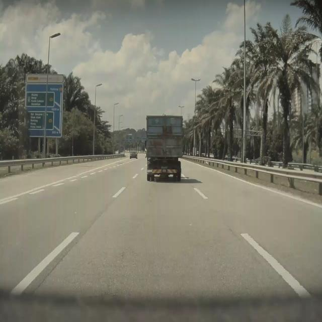
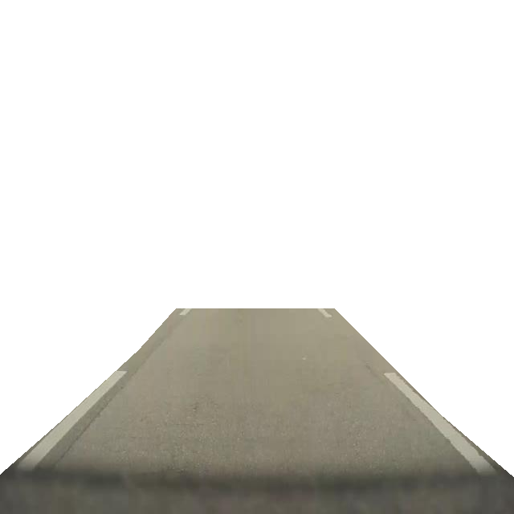

# Lane Detection

LaneDetect is a simple lane detection system that uses computer vision to detect lanes in images. It is built using Python and OpenCV.

## Installation

1. Use this command to clone the repository:

```bash
git clone https://github.com/your-username/lane-detection.git
```

2. Then install these dependencies via the requirements.txt file, using:

```bash
pip install -r requirements.txt
```

## Usage

1. Run the lane detection script using the command:

```bash
python lane_detect.py --image_path path/to/your/image.jpg
```

2. Run the lane detection script with the lane isolation option for the optional parameter of detecting the original lane from the image:

```bash
python lane_detect.py --image_path path/to/your/image.jpg --lane_isolate
```

3. Run the lane detection script with the Gaussian blur option for the optional parameter of Gaussian blur kernel size to reduce noise:

```bash
python lane_detect.py --image_path path/to/your/image.jpg --gaussian_blur_kernel 5
```

**Note:** Gaussian blur kernel size should be an odd number. A larger kernel size will result in a more blurred image, which may prevent any edges from being detected.

Also, default kernel size is 3, for reference.

## Demonstration

```bash
python lane_detect.py --image_path ./Sample.jpeg
```


_Sample.jpeg_

### Output:-

```bash
Lane mask image saved as Sample_lane_mask.jpg
```


_lane_mask.png_

And if you use the lane isolation option, the output will be:-

```bash
python lane_detect.py --image_path ./Sample.jpeg --lane_isolate
```

```bash
Lane lines image saved as isolated_lane_image.png
```


_isolated_lane_image.png_

## Documentation

### OpenCV

The Open Source Computer Vision Library, commonly known as OpenCV, is a robust and versatile toolkit for computer vision and machine learning. This freely available software library has gained widespread adoption in fields such as image manipulation, video analysis, computer vision projects, and machine learning endeavors. OpenCV boasts several noteworthy attributes, including:

- **Cross-platform support**: Works on various operating systems including Windows, Linux, macOS, and mobile platforms.
- **Extensive function library**: Provides over 2500 optimized algorithms for various computer vision and machine learning tasks.
- **Image processing**: Offers a wide range of functions for image filtering, transformation, and analysis.
- **Video analysis**: Includes tools for motion tracking, object detection, and background subtraction in video streams.
- **Camera calibration and 3D reconstruction**: Provides functions for camera calibration and stereo vision.
- **Machine learning**: Includes implementations of various machine learning algorithms that can be used for computer vision tasks.
- **GPU acceleration**: Supports CUDA and OpenCL for hardware-accelerated operations on compatible devices.

In this project, we have used OpenCV image processing of applying Gaussian blur, edge detection using Canny edge detector, and drawing these detected lane lines on the input images.

### Canny Edge Detection

Canny edge detection is a popular edge detection algorithm used in computer vision and image processing. It was developed by John F. Canny in 1986 and is widely used in various applications such as object detection, image segmentation, and computer vision tasks. We used this in our pipeline to detect the lane lines by detecting the edges in a grayscale image.

### Hough Transform

The Hough Transform is a powerful technique used in computer vision for detecting straight lines in images. It was introduced by Paul Hough in 1962 and has since become a fundamental tool in various applications, including lane detection in autonomous driving, edge detection, and line fitting.

### Region Selection

Traditionally a Trapezium region is selected to focus only on the lane lines in the image. However, in this project we have selected a Rectangular Region on the lower half of the image to focus on both straight and curved lanes. This is done using the `region_selection` function. The reason for this is that when we used to select the trapezium region, we were not able to detect the lane lines in the image with curved lanes or with broader lanes. This decision was taken because the trapezium region was too small to detect the lane lines in the image with curved lanes.

### Line Making Algorithm

1. The `average_slope_intercept` function is used to calculate the average slope and intercept of the lane lines in the image.
2. After this we used the `pixel_points` function to get the pixel points for the lane lines in the image.
3. This is repeated for all the lines detected in the image.
4. Finally, we used the `lane_lines` function to get the full length lines for each line detected. This will be used to draw the lane lines on the image.

### Development Notebook

To view the development notebook that we used to develop on colab, please check `OpenCV_Edge_Detection.ipynb`.
